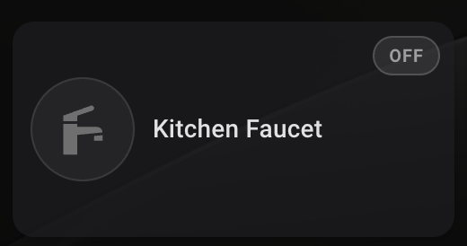
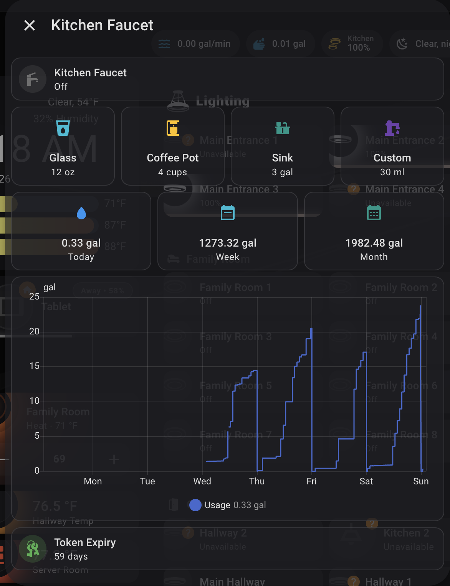
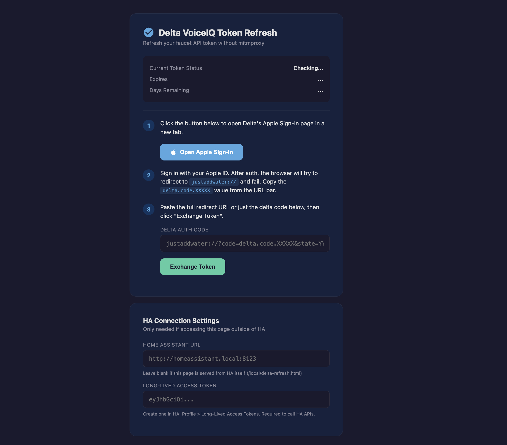
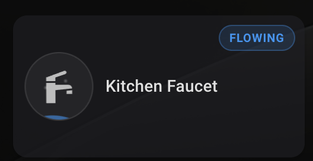
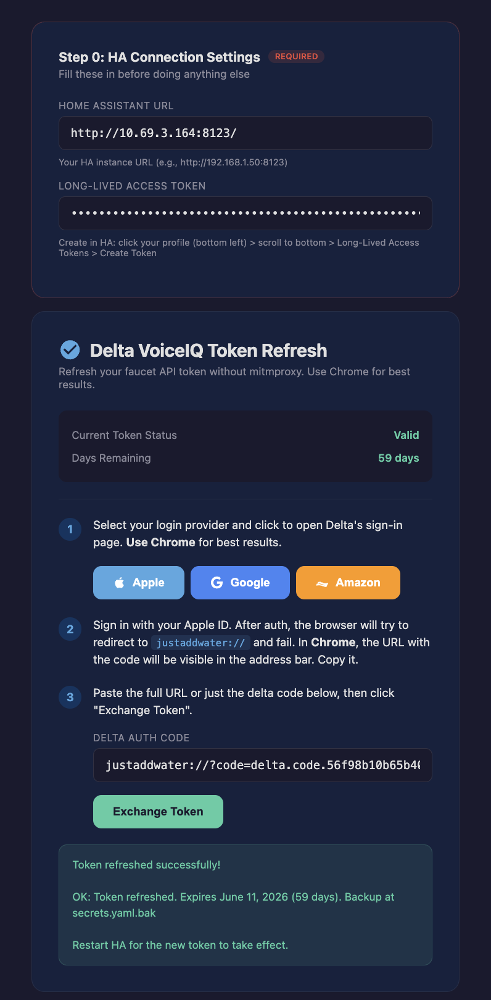

# Delta VoiceIQ 2.0 - Home Assistant Integration

[](https://www.home-assistant.io/)
[](LICENSE)
[](https://hacs.xyz)
[](https://www.deltafaucet.com/voiceiq)

> A complete reverse-engineered integration of **Delta VoiceIQ Version 2** smart faucets with Home Assistant. Control your faucet, dispense precise amounts, track water usage, and manage auth tokens -- all without the official app.

## What This Does

- **On/Off control** via dashboard card, automations, or voice assistants
- **Metered dispensing** with preset containers (Glass, Coffee Pot, Sink) or custom ml amounts
- **Water usage tracking** with daily, weekly, monthly, and yearly sensors
- **Animated dashboard card** with water-fill icon, flow animations, and usage badge
- **Rich popup** (browser_mod) with dispense buttons, usage stats, and history graph
- **Browser-based token refresh** that eliminates mitmproxy for ongoing use
- **Token expiry warnings** via persistent notifications

## Screenshots

| Dashboard Card | Long-Press Popup | Token Refresh |
|:-:|:-:|:-:|
|  |  |  |
| Animated water-fill icon with usage badge | Dispense buttons, usage stats, history | Browser-based token refresh tool |

| Card Flowing | Token Refresh Success |
|:-:|:-:|
|  |  |
| Bubble animation when faucet is on | Successful token exchange |

## Compatibility

| Component | Tested Version |
|-----------|---------------|
| VoiceIQ Module | Gen 2 (product ID: `DELTA2-VOICE`) |
| Module Firmware | 2.0.2.0 |
| DFC@Home App | 2.6.0 (iOS) |
| VoiceIQ API | v2/v3 on `device.deltafaucet.com` |
| Home Assistant | 2024.1+ (tested through 2026.4) |

**Gen 1 vs Gen 2:** This integration targets the **Generation 2 VoiceIQ module** and its API. The DFC@Home app now supports both Gen 1 and Gen 2 modules. The API endpoints should be the same, but Gen 1 has not been tested with this integration. If you have a Gen 1 module and try this, please open an issue with your results.

---

## Quick Start

1. Capture your VoiceIQ token using [mitmproxy](docs/MITMPROXY.md) (one-time)
2. Copy files from this repo into your HA config
3. Add your token, MAC address, and user ID to `secrets.yaml`
4. Restart Home Assistant
5. Add the dashboard card

---

## Repository Structure

```
delta-voiceiq-2.0-ha/
├── README.md
├── LICENSE
├── docs/
│   ├── API.md                         # Full API reference
│   ├── AUTH.md                        # Authentication deep dive
│   └── MITMPROXY.md                   # mitmproxy setup guide
├── packages/
│   └── delta_voiceiq.yaml             # All-in-one HA package
├── www/
│   └── delta-refresh.html             # Token refresh web page
├── scripts/
│   └── delta_token_exchange.sh        # Token exchange shell script
└── secrets.yaml.example               # Template for secrets
```

---

## Prerequisites

**Hardware:**
- Delta VoiceIQ-enabled faucet (Touch2O manufactured after Jan 2018)
- VoiceIQ module connected to WiFi and registered at `device.deltafaucet.com`

**Home Assistant:**
- Home Assistant OS or Supervised (2024.1+)
- File Editor or Studio Code Server add-on
- Terminal & SSH add-on (for shell scripts)

**HACS Components:**
- [Mushroom Cards](https://github.com/piitaya/lovelace-mushroom)
- [card-mod](https://github.com/thomasloven/lovelace-card-mod)
- [browser_mod](https://github.com/thomasloven/hass-browser_mod) (optional, for popup)

**For initial token capture only:**
- [mitmproxy](https://mitmproxy.org/) on a computer
- DFC@Home app on your phone

---

## API Reference

Base URL: `https://device.deltafaucet.com`

### Required Headers

```
Authorization: Bearer <VoiceIQ JWT>
dfc-source: mobile
User-Agent: DFCatHome/2.6.0 CFNetwork/3860.400.51 Darwin/25.3.0
```

### Endpoints

| Endpoint | Method | Description |
|----------|--------|-------------|
| `/api/device/v3/ToggleWater?macAddress=MAC&toggle=on\|off` | POST | Turn faucet on/off |
| `/api/device/v2/Dispense?macAddress=MAC&milliliters=N` | POST | Dispense specific amount (ml) |
| `/api/device/v2/UsageReport?macAddress=MAC&interval=N` | GET | Usage (0=today, 1=week, 2=month, 3=year) |
| `/api/voice/v4/handWashMode` | POST | Hand wash mode |
| `/api/user/v2/UserInfo` | GET | User info, devices, containers |

See [docs/API.md](docs/API.md) for full details.

---

## Authentication

Delta uses **two completely separate** auth systems. Only VoiceIQ is needed.

| Property | VoiceIQ (for faucet) | DFC@Home (NOT for faucet) |
|----------|---------------------|--------------------------|
| Server | `device.deltafaucet.com` | `api.deltafaucet-cw.com` |
| Token lifetime | ~60 days | 15 min (with refresh) |
| Refresh token | No | Yes |
| Login | Apple/Google/Amazon | Azure AD B2C |

The VoiceIQ system has no refresh token. You must re-authenticate every ~60 days. The included browser-based refresh page makes this a 30-second process.

See [docs/AUTH.md](docs/AUTH.md) for the full deep dive.

---

## Initial Token Capture

You need mitmproxy **once** to capture the initial VoiceIQ token. After that, use the browser-based refresh page.

**Quick version:**
1. Install mitmproxy: `brew install mitmproxy` (macOS) or `pip install mitmproxy`
2. Run: `mitmweb --listen-port 8080`
3. Set your phone's WiFi proxy to your computer's IP on port 8080
4. Visit `http://mitm.it` on your phone, install and trust the CA certificate
5. Open the DFC@Home app and sign in
6. In mitmweb, filter for `device.deltafaucet.com` and copy the `Authorization: Bearer ...` token
7. Also grab your MAC address and user ID from the `/api/user/v2/UserInfo` response
8. Remove the proxy from your phone when done

**For the full step-by-step guide with troubleshooting, see [docs/MITMPROXY.md](docs/MITMPROXY.md).**

---

## Home Assistant Setup

### Option A: Package (Recommended)

1. Copy `packages/delta_voiceiq.yaml` to `/config/packages/`
2. Enable packages in `configuration.yaml`:
   ```yaml
   homeassistant:
     packages: !include_dir_named packages
   ```
3. Copy `www/delta-refresh.html` to `/config/www/`
4. Copy `scripts/delta_token_exchange.sh` to `/config/scripts/`
5. Run: `chmod +x /config/scripts/delta_token_exchange.sh`
6. Add to `secrets.yaml`:
   ```yaml
   delta_token: "Bearer eyJhbGciOi..."
   delta_mac_address: "YOUR_MAC_ADDRESS"
   delta_user_id: "YOUR_USER_ID"
   ```
7. Restart HA

### Option B: Manual

Copy each section from the package file into your existing `configuration.yaml`.

---

## Token Lifecycle: Expiry, Notification, and Refresh

The VoiceIQ token lasts ~60 days with **no refresh token**. Here is the full lifecycle:

### How You Will Know It Is Expiring

1. **Dashboard popup:** The faucet card popup shows a token status indicator with days remaining
2. **Template sensor:** `sensor.delta_token_expiry` always shows the days left (e.g. "59 days")
3. **Persistent notification:** An automation checks daily at 9:00 AM. When fewer than 7 days remain, you will see a persistent notification in HA:

> **Delta Faucet Token Expiring Soon**
> Your Delta faucet API token expires in less than 7 days.
> Visit /local/delta-refresh.html to refresh it.

### How To Refresh (30 seconds)

**Prerequisites (one-time setup):**
- Create a **Long-Lived Access Token** in HA: click your profile icon (bottom left) > scroll to bottom > Long-Lived Access Tokens > Create Token. **Save this token somewhere safe** (password manager, notes app, etc.) as HA only shows it once. You will need it every time you refresh.
- Make the shell script executable: in Terminal & SSH add-on, run `chmod +x /config/scripts/delta_token_exchange.sh`

**Refresh steps:**

1. Open **Chrome on your Mac** (Safari does not work reliably for this flow) and go to `http://<your-ha-ip>:8123/local/delta-refresh.html`

2. Fill in the **Step 0: HA Connection Settings** at the top of the page with your HA URL and Long-Lived Access Token. The page saves these in your browser so you only need to enter them once per browser. If you clear your browser data or use a different browser, you will need to enter them again.


3. Click your sign-in provider (Apple, Google, or Amazon) to open Delta's login page in a **new tab**

4. **In the new tab that opened**, open Chrome DevTools: right-click anywhere > **Inspect** > click the **Console** tab. Keep this open.

5. Sign in with your credentials (passkey, password, etc.)

6. **For Apple Sign-In:** After authenticating, you will see a page asking "Do you want to continue using Delta Faucet Cloud with your Apple Account?" Click **Continue**. The page will appear to do nothing, but the redirect URL with your delta code will appear in the **Console** tab.

7. Look in the Console for a line containing `justaddwater://?code=delta.code.XXXXX&state=YYY`. Copy the full URL or just the `delta.code.XXXXX` part.

8. Go back to the refresh page tab, paste it into the Delta Auth Code field

9. Click **Exchange Token**

10. Within ~15 seconds you will see the result:


11. **Restart HA** for the new token to take effect

**Important notes:**
- **Chrome only.** Safari does not work on any platform (Mac, iOS, iPad).
- **DevTools must be open on the sign-in tab** (the new tab that opens after clicking Apple/Google/Amazon), not the refresh page tab.
- **This integration has been tested with Apple Sign-In.** Google and Amazon sign-in should work the same way but have not been tested. If you test with Google or Amazon, please open an issue with your results.
- **Apple Sign-In with Hide My Email:** If you used Apple's "Hide My Email", you can only sign in on devices where your Apple ID keychain/passkey is available. In Chrome, use the "Sign in with passkey from nearby device" option which authenticates via your iPhone's Face ID/Touch ID.
- **Apple rate limiting:** If you see "Your request could not be completed because of an error", wait 10-15 minutes. Apple rate-limits rapid authentication attempts.

### What Happens Behind the Scenes

The shell script (`delta_token_exchange.sh`):
1. Calls Delta PostAuth endpoint with your code
2. Captures the 302 redirect containing a base64-encoded JWT
3. Decodes the double-encoded token (base64 > JSON > base64 > JWT)
4. Validates the JWT format
5. Backs up `secrets.yaml` to `secrets.yaml.bak`
6. Writes the new token to `secrets.yaml`
7. Updates the `exp_ts` timestamp in your automations and configuration
8. Reports status via the HA Supervisor API

### What If the Token Expires Completely?

If the token expires before you refresh, your REST commands will return 401 errors and the usage sensors will go `unknown`. The faucet itself still works manually and via Alexa/Google. Just refresh the token using the steps above and restart HA.

---

## Dashboard

The card uses Mushroom + card-mod for animated water-fill effects.
- **Tap** = toggle on/off
- **Long press** = popup with dispense buttons, usage stats, history

**Important:** browser_mod must be added as an integration (Settings > Devices & Services > Add Integration > Browser Mod), not just installed via HACS.

### Usage Sensor Polling Schedule

The usage sensors automatically poll the Delta API on a regular schedule. No manual refresh needed.

| Sensor | Poll Interval |
|--------|--------------|
| Today's usage | Every 10 minutes |
| Weekly usage | Every 1 hour |
| Monthly usage | Every 5 hours |
| Yearly usage | Every 24 hours |

After an HA restart, sensors will show "unknown" briefly until their first poll cycle completes (up to 10 minutes for the daily sensor). This is normal and resolves automatically.

---

## Example Automations

### Morning Coffee Fill
```yaml
automation:
  - alias: "Morning Coffee"
    trigger:
      - platform: time
        at: "06:30:00"
    action:
      - service: rest_command.delta_faucet_dispense
        data:
          milliliters: 946
```

### Faucet Auto-Off Safety
```yaml
automation:
  - alias: "Faucet Auto-Off"
    trigger:
      - platform: state
        entity_id: input_boolean.delta_faucet_state
        to: "on"
        for:
          minutes: 5
    action:
      - service: rest_command.delta_faucet_off
      - service: input_boolean.turn_off
        target:
          entity_id: input_boolean.delta_faucet_state
```

---

## FAQ and Troubleshooting

### General

**Q: 401 Unauthorized on REST commands?**
Token expired. Refresh at `/local/delta-refresh.html`.

**Q: Can I use the DFC@Home / Azure B2C token?**
No. Different systems, different tokens. Only VoiceIQ tokens work.

**Q: Gen 1 module?**
Untested but likely works. The API endpoints should be the same. Please open an issue with your results.

**Q: Dispense amount inaccurate?**
Accuracy drops below 4oz (118ml). The faucet also has a 4-minute auto-shutoff, capping max dispense at roughly 7.2 gallons.

**Q: Usage sensors show "unknown" after restart?**
REST sensors need their first poll cycle after a restart. They will populate automatically within 10 minutes, or you can force refresh in Developer Tools > Services > `homeassistant.update_entity`.

### Dashboard

**Q: Popup not showing on long-press?**
browser_mod must be added as an **integration** in HA (Settings > Devices & Services > Add Integration > Browser Mod), not just installed via HACS. After adding, hard-refresh your browser.

**Q: Faucet icon not visible on the card?**
This can happen on Android tablets running Fully Kiosk Browser. Force-close the browser and reopen. If the issue persists, restart HA.

**Q: Card animations not updating when faucet state changes?**
Add `entities` to your card_mod config to explicitly tell card-mod which entities to watch:
```yaml
card_mod:
  entities:
    - input_boolean.delta_faucet_state
    - sensor.delta_faucet_usage_today
```

### Token Refresh

**Q: "Failed to set auth code in HA (401)" error?**
You need to fill in **Step 0: HA Connection Settings** at the top of the refresh page. Enter your HA URL and a Long-Lived Access Token (create one at: HA Profile > Long-Lived Access Tokens).

**Q: "Shell script timed out" error?**
The shell script may not be executable. Fix with:
```bash
chmod +x /config/scripts/delta_token_exchange.sh
```
If it still fails, check the log:
```bash
cat /config/www/delta_token_exchange.log
```

**Q: Where do I find the delta code after signing in?**
Open Chrome DevTools **before** signing in (right-click > Inspect > Console tab). After you sign in, the `justaddwater://` redirect URL with your delta code appears in the Console output. It does NOT appear in the address bar.

**Q: Can I use Safari for token refresh?**
No. Safari does not work reliably on any platform (Mac, iOS, iPad). It either dismisses the redirect URL too quickly, shows a "cannot open page" error without preserving the URL, or hands it off to the DFC@Home app on iOS. Use Chrome.

**Q: Apple Sign-In shows "Your request could not be completed"?**
Apple rate-limits authentication attempts. Wait 10-15 minutes and try again.

**Q: I used "Hide My Email" with Apple and can't sign in on Chrome?**
In Chrome, when the Apple sign-in page loads, look for "Sign in with passkey from nearby device" or a passkey icon. This lets you authenticate via your iPhone's Face ID/Touch ID even though you're in Chrome.

**Q: Which browser should I use for token refresh?**
**Chrome only.** Open DevTools (Inspect > Console) before signing in to see the delta code.

---

## Disclaimer

Not affiliated with Delta Faucet or Masco Corporation. Use at your own risk. Automated water control could cause flooding if misused.

## Credits and Acknowledgments

**Dashboard Card Styling:**
- [@Anashost](https://github.com/Anashost) - Badge theme and water-fill animations inspired by [HA Animated Cards](https://github.com/Anashost/HA-Animated-cards/blob/main/appliances.md)

**Required Custom Components:**
- [@piitaya](https://github.com/piitaya) - [Mushroom Cards](https://github.com/piitaya/lovelace-mushroom)
- [@thomasloven](https://github.com/thomasloven) - [card-mod](https://github.com/thomasloven/lovelace-card-mod) and [browser_mod](https://github.com/thomasloven/hass-browser_mod)
- [HACS](https://hacs.xyz) - Home Assistant Community Store

**Tools Used:**
- [mitmproxy](https://mitmproxy.org/) - API reverse-engineering and token capture
- [jwt.io](https://jwt.io) - JWT token inspection

**Prior Art:**
- [@evantobin](https://github.com/evantobin) - [homebridge-voiceiq](https://github.com/evantobin/homebridge-voiceiq) demonstrating VoiceIQ API control
- [@pvmac2194](https://gist.github.com/pvmac2194) - [Delta VoiceIQ API gist](https://gist.github.com/pvmac2194/d1f8d6fcdecd7cef2843ad7ce138f1ce)

**Built With:**
- [Home Assistant](https://www.home-assistant.io/)
- [Delta VoiceIQ](https://www.deltafaucet.com/voiceiq) by Delta Faucet Company

MIT License.
